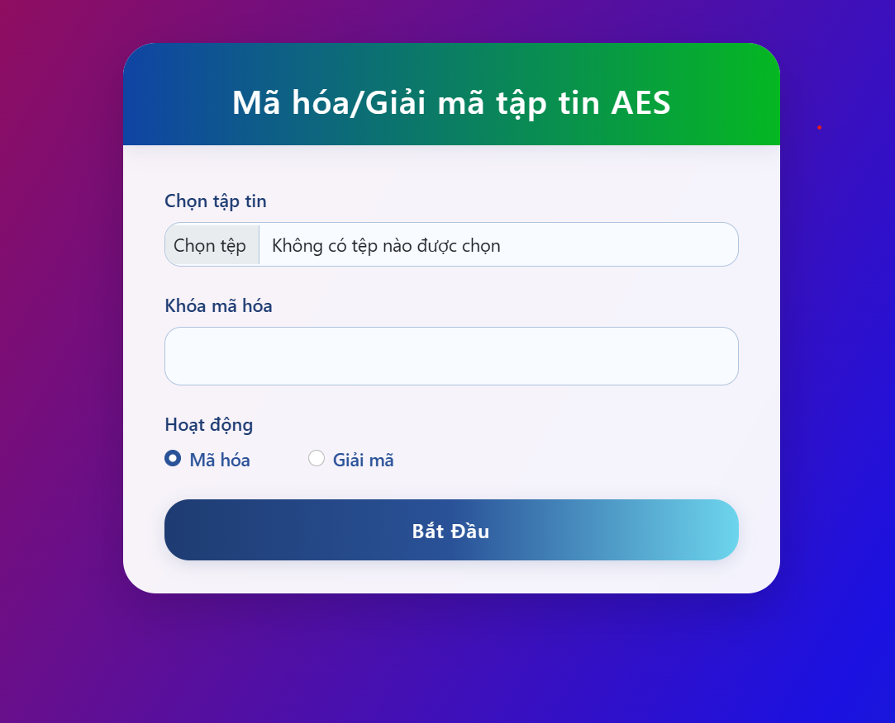
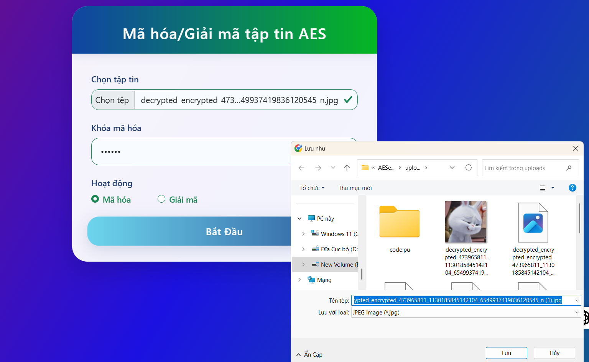
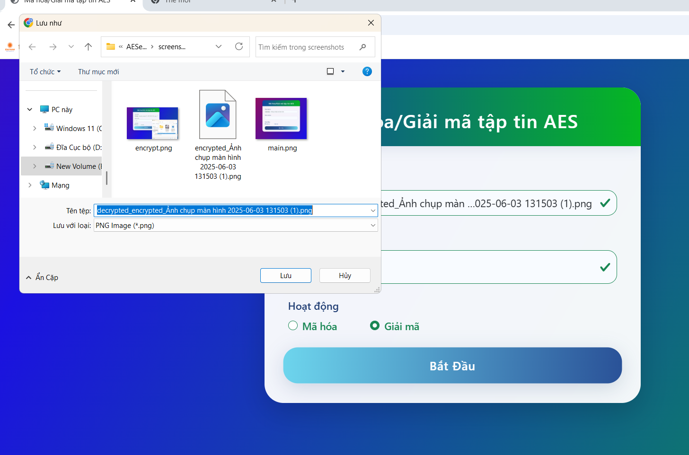
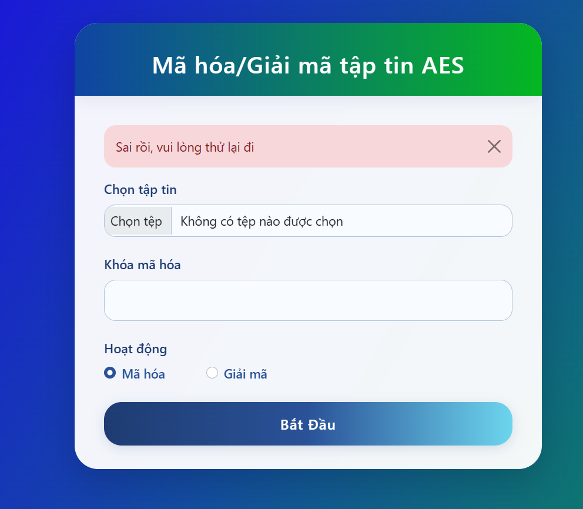

# Ứng dụng Web Mã hóa/Giải mã tập tin AES

Một ứng dụng web giúp mã hóa và giải mã tập tin an toàn bằng thuật toán AES (Advanced Encryption Standard).

## Tính năng

- Mã hóa và giải mã tập tin sử dụng AES-256
- Nhập khóa mã hóa tự do, bảo mật bằng SHA-256
- Giao diện web hiện đại, đẹp mắt, dễ sử dụng
- Hỗ trợ mọi loại tập tin
- Tự động tải về tập tin sau khi xử lý
- Kiểm tra hợp lệ và thông báo lỗi thân thiện

## Yêu cầu

- Python 3.7 trở lên
- Flask
- pycryptodome
- Werkzeug

## Cài đặt

1. Tải mã nguồn về:
```bash
git clone <đường-dẫn-repo>
cd <tên-thư-mục>
```

2. Tạo môi trường ảo (khuyến khích):
```bash
python -m venv venv
# Trên Windows:
venv\Scripts\activate
# Trên Mac/Linux:
source venv/bin/activate
```

3. Cài đặt các thư viện cần thiết:
```bash
pip install -r requirements.txt
```

## Sử dụng

1. Chạy ứng dụng:
```bash
python app.py
```

2. Mở trình duyệt và truy cập:
```
http://localhost:5001
```

## Hướng dẫn sử dụng chi tiết

### 1. Giao diện chính

- Giao diện chính của ứng dụng với 3 phần chính:
  - Chọn file cần mã hóa/giải mã
  - Nhập khóa mã hóa
  - Chọn thao tác (mã hóa/giải mã)

### 2. Mã hóa file

- Chọn file cần mã hóa
- Nhập khóa mã hóa
- Chọn "Mã hóa"
- Nhấn "Bắt Đầu"
- File đã mã hóa sẽ tự động tải về

### 3. Giải mã file

- Chọn file đã mã hóa
- Nhập đúng khóa đã dùng để mã hóa
- Chọn "Giải mã"
- Nhấn "Bắt Đầu"
- File đã giải mã sẽ tự động tải về

### 4. Thông báo lỗi

- Hiển thị thông báo lỗi rõ ràng khi:
  - Chưa chọn file
  - Chưa nhập khóa
  - Sai khóa giải mã
  - File không hợp lệ

## Lưu ý bảo mật

- Khóa mã hóa phải được giữ bí mật, không chia sẻ cho người khác
- Phải sử dụng đúng khóa đã mã hóa để giải mã thành công
- Ứng dụng tạo thư mục 'uploads' để lưu tạm file, bạn có thể xóa file trong đó nếu muốn
- Không nên giải mã file không phải do chính ứng dụng này mã hóa

## Giấy phép

Dự án này sử dụng giấy phép MIT. Bạn có thể tự do sử dụng, chỉnh sửa, chia sẻ.
